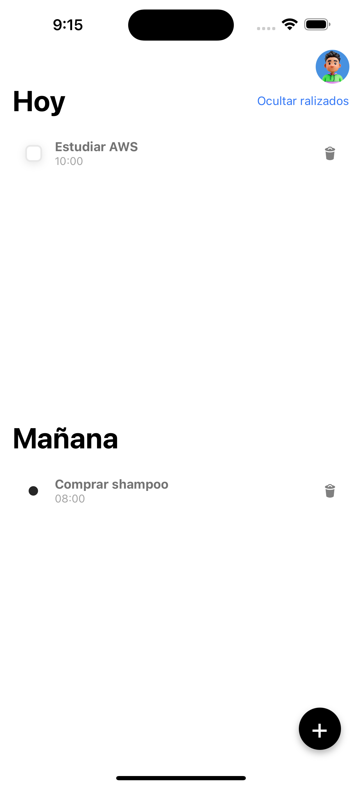
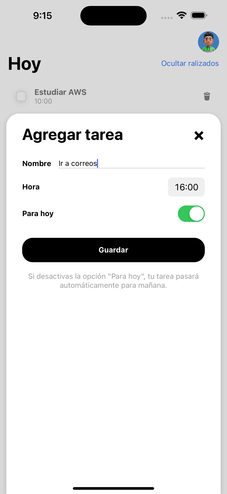

# Todo App - React Native

## Descripción

Esta aplicación de tareas desarrollada con React Native y Typescript en Expo te permite gestionar tus tareas de manera fácil y rápida. Puedes crear y eliminar tareas, y el estado de la aplicación está manejado de manera eficiente con Zustand. Además, todas tus tareas se guardan localmente.

## Capturas de pantalla

## Características

- **Gestión de Tareas**: Crea nuevas tareas, elimina y marca tareas como completadas.
- **Estado Global con Zustand**: Utilizamos Zustand para manejar el estado global de la aplicación de manera eficiente.
- **Persistencia Local**: Todas tus tareas se guardan localmente, lo que te permite acceder a ellas incluso cuando no estás conectado a internet.
- **Desarrollado con Expo**: La aplicación está construida utilizando Expo, facilitando el desarrollo y la implementación en múltiples plataformas.
